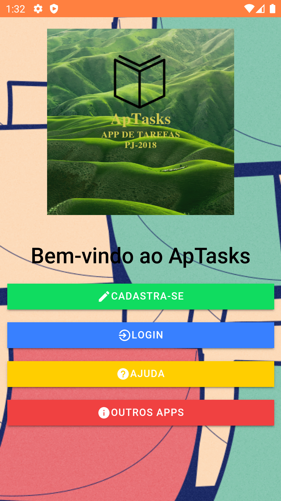

# ApTasks
   
- App feito para adicionar contatos e tarefas

  

    
  

- Versão 1.3 atual - Correções ao design e aplicações.

- Versão 1.2 - Solução do erro na barra de status do aplicativo, 
como também na redução da foto de perfil.

- Versão 1.1 - Soluções de erros em privacidade.

- Versão 1.0 - Melhorias no design do App e no banco de dados.

* Para instalar o projeto veja algumas orientações abaixos:

 - Precisa instalar o nodejs lts 10.16:
    baixe nodejs: https://nodejs.org/en/

 - Logo após ter instalado, digite no terminal ou cmd:
    
    npm i 
    
 - Depois digite: 
   
   ionic serve

 - Para versão mobile Android: 
    
    ionic cordova run android 
    
 - Para versão mobile iOS:   
 
    ionic cordova run ios

Mais informações no site do ionic framework: 
    https://ionicframework.com/docs
    

